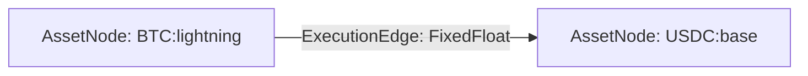
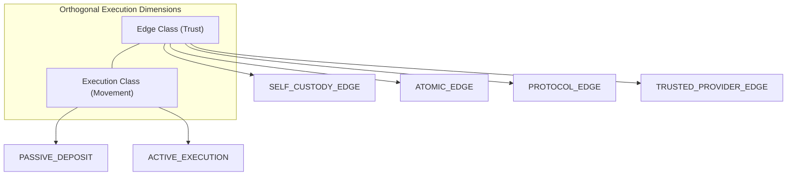
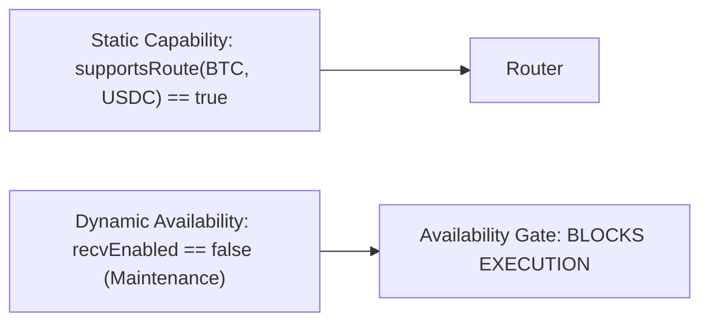
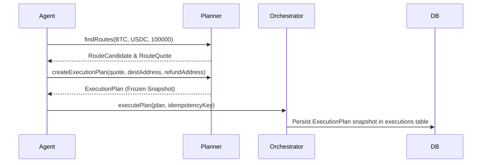
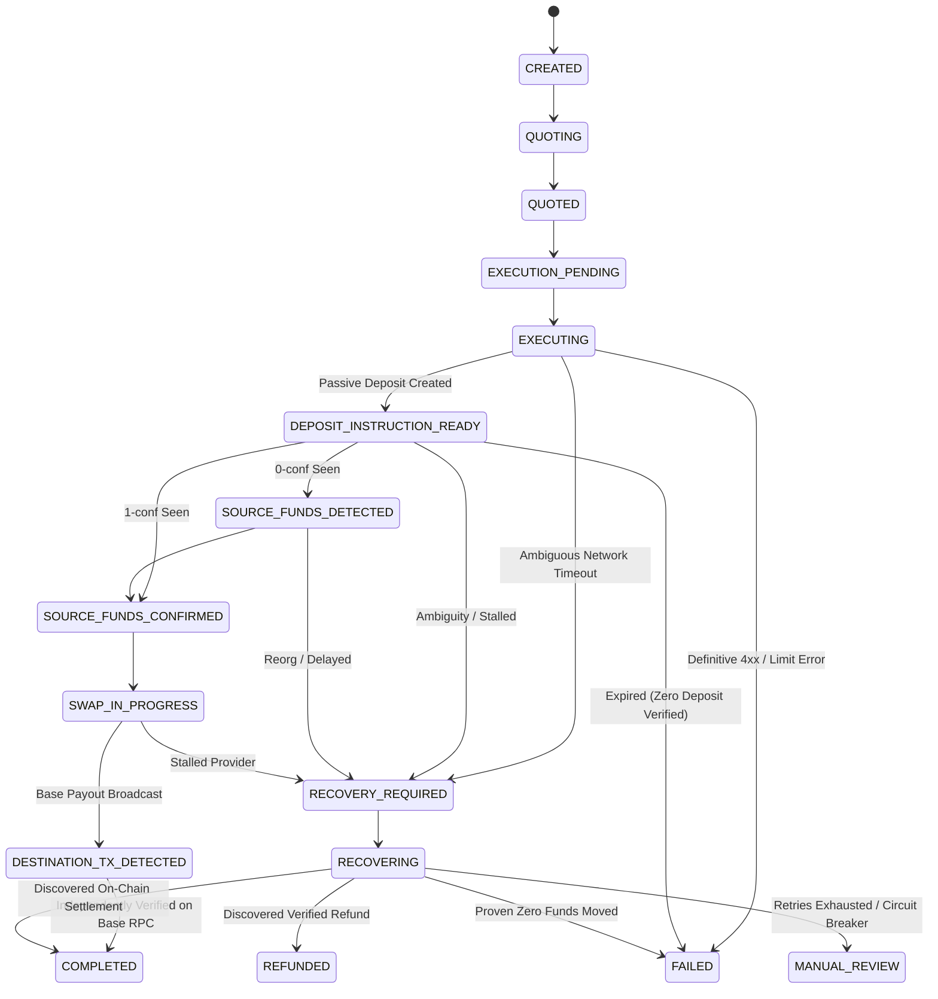
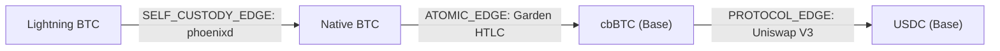

# UNIVERSAL AGENT ASSET ROUTER — ARCHITECTURE V3

> [!NOTE]
> **HISTORICAL — SUPERSEDED BY ARCHITECTURE V4**  
> This document specifies the earlier Architecture V3 design (provider-independent execution graph using external swap providers). It is retained as an immutable engineering audit trail. The active architecture is now defined in [`ARCHITECTURE_V4_SOVEREIGN_CORE.md`](ARCHITECTURE_V4_SOVEREIGN_CORE.md).

**System Definition**: Provider-Independent Execution Graph Engine for Autonomous Software & AI Agents.  
**Version**: 3.0.0-freeze  
**Status**: Architecture Frozen & Phase 1 Implemented  
**Date**: 2026-09-03  

---

## 1. PRODUCT BOUNDARY

The **Universal Agent Asset Router** is a specialized execution graph engine designed specifically for software and AI agents. Its primary function is to transform an asset position on network $A$ into an asset position on network $B$:

$$\text{Asset } X \text{ on Network } A \xrightarrow{\text{Execution Graph}} \text{Asset } Y \text{ on Network } B$$

### Core Operating Invariants:
1. **Machine-Safe Execution**: Engineered for autonomous software agents where deterministic recovery, explicit state machines, and cryptographic verification matter more than consumer UI convenience.
2. **Provider Independence**: The router orchestrator and core domain models contain zero provider-specific logic, constants, or types. Providers are external execution edges plugged into the graph.
3. **No Wallet Custody (V1)**: The router does not hold private keys, manage hot wallets, sign transactions, pay invoices, or maintain merchant balances. The router issues deposit instructions, the client funds them externally, and the router tracks and independently verifies settlement.
4. **Independent Settlement Truth**: External provider claims (e.g. `status: "COMPLETED"`) are strictly treated as untrusted hints. State completion requires independent cryptographic/RPC on-chain verification.

---

## 2. ASSET NODE MODEL (GRAPH NODES)

Every financial position in the system is modeled as a canonical, immutable **`AssetNode`**:

```typescript
export interface AssetNode {
  asset: string;        // Normalized uppercase (e.g. 'BTC', 'USDC', 'CBBTC')
  network: string;      // Normalized lowercase (e.g. 'lightning', 'bitcoin', 'base')
  tokenContract?: string | undefined; // Normalized lowercase EVM contract address
}
```

### Deterministic Identity:
* Asset identity is deterministic and string-serializable:  
  $$\text{AssetNodeToString} = \text{ASSET}:\text{network}[:\text{0xcontract}]$$
* Example Nodes:
  * `BTC:lightning` (Bitcoin on Lightning Network)
  * `BTC:bitcoin` (Native on-chain Bitcoin UTXO)
  * `USDC:base:0x833589fcd6edb6e08f4c7c32d4f71b54bda02913` (Canonical Circle USDC on Base)
  * `CBBTC:base:0xcbb7c0000ab88b473b1f5afd9ef808440eed33bf` (Coinbase Wrapped BTC on Base)
* EVM contract comparison is strictly case-insensitive but stored canonically in lowercase.

---

## 3. EXECUTION EDGE MODEL (GRAPH EDGES)

Execution primitives between asset nodes are modeled as **`ExecutionEdge`** abstractions:



An execution edge encapsulates:
* Static pair compatibility
* Live dynamic runtime availability
* Cryptographic and protocol trust boundaries
* Execution semantics (passive vs active)
* Discrete operational capabilities

```typescript
export interface IExecutionEdge {
  readonly id: string;
  readonly name: string;
  readonly edgeClass: EdgeClass;
  readonly executionClass: ExecutionClass;
  readonly sourceNode: AssetNode;
  readonly destinationNode: AssetNode;
  readonly edgeCapabilities: EdgeCapabilities;

  supportsRoute(source: AssetNode, destination: AssetNode): boolean;
  getRuntimeAvailability(): Promise<EdgeRuntimeAvailability>;
  getQuote(sourceAmountAtomic: string, destinationAddress?: string): Promise<RouteQuote>;
  createExecution(plan: ExecutionPlan, idempotencyKey: string): Promise<ProviderExecutionResult>;
  getStatus(providerExecutionId: string, orderToken?: string): Promise<NormalizedProviderStatus>;
  requestRefund?(providerExecutionId: string, refundAddress: string, orderToken?: string): Promise<RefundResult>;
}
```

---

## 4. EDGE TRUST CLASSES

Architecture V3 classifies the security and counterparty risk of edges into four discrete architectural classes:

| Edge Class | Definition | Trust Assumption | Example |
| :--- | :--- | :--- | :--- |
| **`SELF_CUSTODY_EDGE`** | First-party node or signer operated directly by client/router | Zero counterparty trust; self-sovereign keys | Router-owned `phoenixd` splice, local EVM keypair |
| **`ATOMIC_EDGE`** | Peer-to-peer cryptographic swap protocol | Cryptographic atomicity via HTLC or submarine swap; no counterparty theft risk | Garden Finance, Boltz submarine swap |
| **`PROTOCOL_EDGE`** | Smart contract protocol, AMM pool, or decentralized solver network | Contract immutability & liquidity pool solvency | Uniswap V3, Aerodrome Slipstream, Chainflip |
| **`TRUSTED_PROVIDER_EDGE`** | Centralized broker, exchange, or market maker | Counterparty trust during transfer window | FixedFloat, SideShift |

In V1, **FixedFloat is classified strictly as a `TRUSTED_PROVIDER_EDGE`**.

---

## 5. EXECUTION CLASSES (ORTHOGONAL TO EDGE CLASS)

Trust classification is strictly decoupled from execution mechanics:



### `PASSIVE_DEPOSIT`:
* Calling `createExecution()` only produces **deposit instructions** (Lightning invoice, Bitcoin P2WSH address).
* **Zero source funds move** upon order creation.
* An ambiguous response or network timeout before deposit instructions are exposed is financially unfunded and safe to abort to `FAILED`.
* *Example*: FixedFloat, SideShift, Garden deposit order.

### `ACTIVE_EXECUTION`:
* Calling `createExecution()` signs, broadcasts, debits, or transfers balances.
* An ambiguous timeout **cannot** be failed without cryptographic proof of non-inclusion!
* Requires durable outbound journal locking and automated balance reconciliation.
* *Example*: On-chain EVM DEX swap, Phoenixd `/sendtoaddress`.

---

## 6. CAPABILITY MODEL

Each edge independently declares six discrete capabilities:

$$\mathbf{Capabilities} = \{ \text{DISCOVER}, \text{QUOTE}, \text{PREPARE}, \text{EXECUTE}, \text{VERIFY}, \text{RECOVER} \}$$

Each capability is declared as `SUPPORTED`, `UNSUPPORTED`, or `CONDITIONAL`.

> [!CRITICAL]
> **Cardinal Invariant**: Support for one capability must **NEVER** imply support for another!
> * $\text{EXECUTE} \neq \text{QUOTE}$ (A node may execute without offering pre-flight quotes).
> * $\text{EXECUTE} \neq \text{PREPARE}$ (An exchange may not provide dry-run transaction previews).
> * $\text{VERIFY} \neq \text{Provider Status}$ (Provider saying "OK" is not settlement truth).
> * $\text{RECOVER} \neq \text{Retry Create}$ (Retrying create creates duplicate orders, not recovery).

---

## 7. STATIC CAPABILITY VS RUNTIME AVAILABILITY

Architecture V3 strictly separates compile-time static route support from real-time operational availability:



* **Static Metadata**:
  * Edge class & execution class
  * Token address & pair support
  * Mathematical unit decimals
* **Dynamic / Live State**:
  * Currency maintenance flags (`BTCLN recv == 0`)
  * Dynamic liquidity limits & minimums
  * Network congestion / provider downtime
  * Health check heartbeats

If an edge statically supports a route but its live currency receiving is disabled (`recv == 0`), the router **blocks execution before creating any order**, throwing domain error `PROVIDER_MAINTENANCE` or `ROUTE_UNAVAILABLE`.

---

## 8. ROUTE QUOTE MODEL

Quotes represent a provider-independent estimation of an asset conversion:
* Fully denominated in **strictly integer atomic units** (e.g. satoshis, wei, atomic USDC).
* Floating-point arithmetic for money is strictly prohibited across the codebase.
* Fields:
  * `quoteId`: Unique identifier
  * `sourceNode` / `destinationNode`: Canonical asset nodes
  * `inputAmountAtomic`: Exact deposit satoshis/units
  * `estimatedOutputAmountAtomic`: Expected settlement units
  * `minAmountAtomic` / `maxAmountAtomic`: Live operational boundaries
  * `expiresAt`: ISO-8601 UTC timestamp
  * `edgeClass` & `executionClass`: Invariant classifications

---

## 9. EXECUTION PLAN

Architecture V3 explicitly decouples **`RouteQuote`**, **`ExecutionPlan`**, and **`ExecutionRecord`**:

1. **`RouteQuote`**: "What route is currently available and what are the expected parameters?"
2. **`ExecutionPlan`**: "What exact snapshot of parameters is authorized for execution?"
3. **`ExecutionRecord`**: "What is the persistent lifecycle state of the execution in the database?"



An `ExecutionPlan` freezes the quote parameters immutably. If provider market conditions change mid-flight, the in-flight execution cannot have its parameters silently rewritten.

---

## 10. EXECUTION STATE MACHINE

The system enforces an explicit 15-state lifecycle engine:



### Safety Invariants:
1. **Source Funds Moved $\implies$ Ordinary `FAILED` Prohibited**: Once source funds are detected or confirmed, transition to `FAILED` is mathematically impossible. The system can only transition to `RECOVERY_REQUIRED`, `REFUNDED`, or `MANUAL_REVIEW`.
2. **Terminal States Immutable**: `COMPLETED`, `FAILED`, `REFUNDED`, and `MANUAL_REVIEW` have zero outgoing transitions.

---

## 11. EVIDENCE MODEL

The router maintains an unambiguous separation between source evidence and destination evidence:

* **`SourceSettlementEvidence`**:
  * Records payment hash, Lightning preimage, or Bitcoin UTXO TxID.
  * Tracks confirmation count and detection timestamps.
* **`DestinationSettlementEvidence`**:
  * Records Base L2 transaction hash, block number, and gas used.
  * Explicitly records verified token contract, recipient address, and verified amount.
  * Status: `CONFIRMED`, `REVERTED`, `WRONG_RECIPIENT`, `WRONG_TOKEN`, `AMOUNT_MISMATCH`.

---

## 12. IDEMPOTENCY & PROVIDER REQUEST JOURNAL

### Router-Level Idempotency:
* All client requests supply an `idempotencyKey`.
* SQLite guarantees that duplicate requests return the existing execution state without triggering duplicate dispatches.

### Durable Provider Request Journal:
To solve the ambiguous `createExecution` problem, every outbound provider dispatch is durably journaled in SQLite table `provider_request_journal` **before** network transmission:

| Field | Purpose |
| :--- | :--- |
| `id` | Unique journal entry ID (`jnl_...`) |
| `execution_id` | Foreign key to `executions.id` |
| `provider_id` | Target provider identifier (`fixedfloat`) |
| `operation` | Operation name (`createExecution`) |
| `attempt_number` | Monotonic dispatch attempt counter |
| `request_started_at` | UTC timestamp before socket write |
| `request_completed_at` | UTC timestamp of response receipt |
| `provider_execution_id` | Upstream provider order ID |
| `result_classification` | `SUCCESS`, `ERROR`, `AMBIGUOUS_TIMEOUT` |
| `response_persisted` | Boolean flag confirming DB commit |

---

## 13. PROVIDER AMBIGUITY HANDLING

When an outbound HTTP request to FixedFloat times out or disconnects:

* **Case A (Unfunded / Unexposed)**:  
  If the edge is `PASSIVE_DEPOSIT`, no deposit instructions were exposed to the user, and no source funds could have moved. During reconciliation, if the provider has no record of the order or the order expired unfunded, the execution safely transitions to `FAILED`.
* **Case B (Exposed / Potential Inbound Transfer)**:  
  If a deposit address or invoice was previously generated or exposed, the router **never** creates a replacement order. It repeatedly queries provider status and blockchain RPCs until conclusive resolution is obtained.

---

## 14. RECOVERY MODEL

When an anomaly occurs:
1. The execution transitions to `RECOVERY_REQUIRED`.
2. The recovery worker increments `recovery_attempts`.
3. If attempts exceed `maxRecoveryAttempts` (default: 5), execution escalates to `MANUAL_REVIEW` to trip the circuit breaker and alert operations.
4. If the provider issues an emergency refund, transition to `REFUNDED` is blocked until an on-chain refund transaction hash is provided and verified.

---

## 15. INDEPENDENT DESTINATION VERIFICATION

Provider status `status: "COMPLETED"` is **insufficient** to complete an execution. The router's `ChainVerifier` queries the destination blockchain (Base L2 RPC):

$$\text{COMPLETED} \iff \begin{cases}
\text{Transaction receipt status} == 1 \text{ (Success)} \\
\text{Log emitter contract} == \text{\texttt{0x833589fCD6eDb6E08f4c7C32D4f71b54bdA02913}} \\
\text{Transfer recipient} == \text{Client Destination Address} \\
\text{Transfer amount} \ge \text{Expected Minimum Settlement Amount}
\end{cases}$$

If any condition fails, the execution is flagged `MANUAL_REVIEW`.

---

## 16. FIXEDFLOAT'S ROLE IN ARCHITECTURE V3

FixedFloat is integrated strictly as an implementation of `IExecutionEdge`:
* Edge Class: `TRUSTED_PROVIDER_EDGE`
* Execution Class: `PASSIVE_DEPOSIT`
* Source Assets: `BTC:lightning`, `BTC:bitcoin`
* Destination Asset: `USDC:base:0x833589fcd6edb6e08f4c7c32d4f71b54bda02913`
* Availability Gate: Live check on `POST /ccies`. If `btcln.recv == 0`, edge availability is immediately marked `isAvailable: false`, preventing order generation.

---

## 17. WHY FIXEDFLOAT IS AN ADAPTER, NOT A DEPENDENCY

* The core orchestrator, route planner, SQLite schema, state machine, and verifier have **zero references to FixedFloat**.
* FixedFloat implements standard interfaces `IExecutionEdge` and `IExecutionProvider`.
* If FixedFloat is decommissioned tomorrow, the router core continues operating identically with other edges.

---

## 18. V1 CUSTODY BOUNDARY

The V1 Universal Agent Asset Router strictly maintains a **Zero-Custody Boundary**:
* The router never manages user private keys or seeds.
* The router never operates EVM hot wallets.
* The router never signs on-chain transactions or pays Lightning invoices.
* The client agent funds the swap via the returned deposit instruction.

---

## 19. FUTURE MULTI-EDGE EXTENSION

The `RouteCandidate` model supports composing multi-edge execution graphs:



When multi-edge execution is enabled in future phases, the planner orchestrates sequential edge progression across the graph.

---

## 20. EXPLICIT NON-GOALS FOR V1

1. **No Real-Money Automated Payments**: Router will not autonomously pay Lightning invoices or spend funds.
2. **No Custom Smart Contract Deployment**: Router will not require custom EVM smart contracts on Base.
3. **No Complex Multi-Hop Graph Optimization**: Router will not run Dijkstra or Bellman-Ford algorithms across hypothetical liquidity graphs.
4. **No Custodial Wallet Balance Management**: Router will not act as a custodian or bank for agents.
