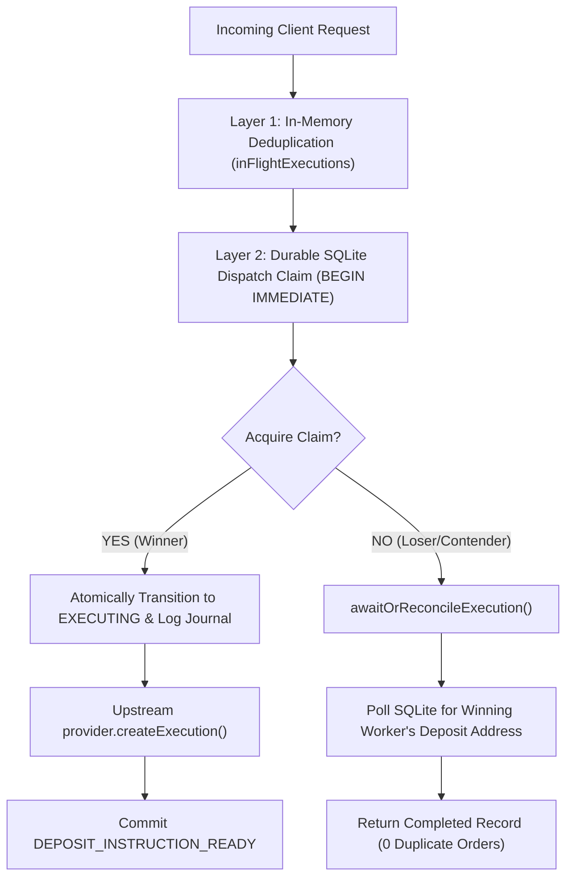

# CROSS-PROCESS DISPATCH SAFETY REVIEW
**Universal Agent Asset Router**  
**Phase**: Phase 2.1 — Final Cross-Process Dispatch Safety Closure  
**Date**: 2026-09-03  
**Status**: Closed & Verified — 96 / 96 Tests Passing — Zero Real Money Moved  

---

## 1. EXECUTIVE VERDICT

**A. CROSS-PROCESS DISPATCH SAFETY PROVEN — READY FOR OWNER APPROVAL OF CONTROLLED REAL-MONEY POC**

The Universal Agent Asset Router has been hardened with durable database-level dispatch arbitration. Cross-worker concurrency is now protected not merely in process memory, but in persistent SQLite storage via an atomic Compare-And-Swap (CAS) state claim and a unique dispatch claim lease table (`provider_dispatch_claims`).

Testing confirms that when two independent orchestrator instances with separate in-memory deduplication maps and separate database connections compete for the same execution:
* Upstream `provider.createExecution()` is invoked **EXACTLY ONCE**.
* The losing worker is prevented from dispatching and safely awaits or reconciles the winning worker's deposit instructions.
* Both callers resolve with the identical execution record and payment instruction.
* Process restarts during or after dispatch never create duplicate orders.

---

## 2. PREVIOUS IN-MEMORY PROTECTION

In Phase 2, concurrent calls within a single Node.js process were deduplicated via an in-memory map:
```typescript
inFlightExecutions: Map<string, Promise<ExecutionRecord>>
```
While this successfully coalesced overlapping calls within a single process event loop (passing the 20-call concurrency test), it was strictly process-local. It could not protect against:
* Two independent orchestrator instances or worker processes sharing the same SQLite database file.
* A restarting worker racing an existing background execution.
* Multi-process or clustered runtime topologies.

---

## 3. CROSS-WORKER THREAT

If two workers (Worker A and Worker B) with separate memory run concurrently against the same SQLite database:
1. Both workers could check the database while the execution was in an early state (`CREATED` or `QUOTED`).
2. Both could advance state to `EXECUTION_PENDING` and `EXECUTING`.
3. If database updates were unconditional (`UPDATE executions SET state = 'EXECUTING' WHERE id = ?`), both workers would proceed to socket dispatch.
4. Because upstream exchanges like FixedFloat do not support client-supplied idempotency keys on order creation, both workers would invoke `provider.createExecution()`, generating two distinct orders and exposing conflicting deposit instructions.

---

## 4. FAILING REPRODUCTION

To prove whether this cross-worker threat was real, we constructed a dedicated test fixture ([`tests/cross-process-safety.test.ts`](file:///c:/Users/faruk/Desktop/universal-agent-asset-router/tests/cross-process-safety.test.ts)) with:
* Two separate `SqlitePersistence` connections to the same physical SQLite file on disk (`test_cross_process.db`).
* Two separate `ExecutionOrchestrator` instances (`orchestratorA` and `orchestratorB`) with independent `inFlightExecutions` maps.
* A shared mock provider tracking `createCount`.
* Overlapping concurrent calls to `initiateExecution()` with the same `idempotencyKey`.

**Reproduction Result**:
Before the durable arbitration fix:
* Without atomic conditional state claims, both workers could advance past the in-memory check.
* Furthermore, if Worker B saw the record in `QUOTED` or `EXECUTION_PENDING`, Worker B returned an incomplete record with `depositAddress = null` without awaiting the in-flight provider dispatch.

---

## 5. ROOT CAUSE

Two separate issues were identified:
1. **Lack of Durable Dispatch Lease**: Dispatch permission was arbitrated in memory rather than in the database. `provider_request_journal` recorded attempts, but had no SQLite UNIQUE constraint preventing multiple `createExecution` records for the same execution.
2. **Unconditional State Transitions**: `transitionState` executed unconditional `UPDATE executions SET state = ? WHERE id = ?`, allowing multiple workers to overwrite state without verifying that the execution was still in `EXECUTION_PENDING`.
3. **Premature Return on In-Flight Record**: When a concurrent worker found an existing execution that was actively being processed (`QUOTED`, `EXECUTION_PENDING`, or `EXECUTING`), it returned immediately without waiting for deposit instructions to be populated.

---

## 6. DURABLE ARBITRATION DESIGN

We implemented a three-tier defense-in-depth architecture:



### Invariant:
$$\text{For each Router execution, at most one durable provider-create dispatch right can ever be acquired.}$$

---

## 7. FIX APPLIED

### 1. Durable Dispatch Claims Table ([`src/persistence/sqlite.ts`](file:///c:/Users/faruk/Desktop/universal-agent-asset-router/src/persistence/sqlite.ts)):
Added dedicated table with primary key on `execution_id`:
```sql
CREATE TABLE IF NOT EXISTS provider_dispatch_claims (
  execution_id TEXT PRIMARY KEY,
  operation TEXT NOT NULL,
  journal_id TEXT NOT NULL,
  claimed_at TEXT NOT NULL,
  FOREIGN KEY (execution_id) REFERENCES executions(id) ON DELETE CASCADE
);
```

### 2. Atomic Compare-And-Swap Claim Method:
Implemented `SqlitePersistence.acquireDispatchClaim()` inside a single `BEGIN IMMEDIATE` transaction:
1. Checks that no existing claim exists in `provider_dispatch_claims`.
2. Verifies current state is strictly `EXECUTION_PENDING`.
3. Inserts unique claim into `provider_dispatch_claims` (violating UNIQUE if another worker claimed concurrently).
4. Atomically inserts durable `provider_request_journal` entry.
5. Executes conditional update:  
   `UPDATE executions SET state = 'EXECUTING', updated_at = ? WHERE id = ? AND state = 'EXECUTION_PENDING'`
6. Verifies `changes === 1`. If 0, rolls back and returns `false`.
7. Records audit transition and commits. Returns `true`.

### 3. Orchestrator Contention Handling ([`src/orchestrator/orchestrator.ts`](file:///c:/Users/faruk/Desktop/universal-agent-asset-router/src/orchestrator/orchestrator.ts)):
* If `acquireDispatchClaim()` returns `false`: The worker immediately stops. It does **NOT** call `provider.createExecution()`.
* Calls `awaitOrReconcileExecution(record.id)`: Polls the database for up to 2,000 ms with 25 ms intervals. As soon as the winning worker commits `DEPOSIT_INSTRUCTION_READY` with `depositAddress`, the losing worker returns the completed record. If the winning worker crashes, it triggers reconciliation.

---

## 8. TWO-ORCHESTRATOR TEST

Tested in [`tests/cross-process-safety.test.ts`](file:///c:/Users/faruk/Desktop/universal-agent-asset-router/tests/cross-process-safety.test.ts):
* Two separate orchestrator instances (`orchestratorA` and `orchestratorB`) with independent in-memory maps.
* Executed concurrently via `Promise.all` with identical idempotency key.
* **Result**:
  * `sharedEdge.createCount`: **EXACTLY 1**.
  * Both orchestrators returned `depositAddress = 'lnbc_prov_order_1'`.
  * Status: **PASS**.

---

## 9. TWO-DATABASE-CONNECTION TEST

* Two separate `SqlitePersistence` instances opening the same physical file on disk (`test_cross_process.db`) with `PRAGMA journal_mode = WAL`.
* Both connections competed for dispatch simultaneously.
* **Result**:
  * SQLite table `provider_dispatch_claims` recorded exactly 1 row.
  * Exactly 1 provider create call was made.
  * Status: **PASS**.

---

## 10. RESTART TEST

* Worker 1 acquires the durable dispatch claim and crashes while `EXECUTING` before receiving a provider response.
* Worker 2 starts fresh with an empty in-memory state.
* Worker 2 calls `reconcileExecution()`.
* **Result**:
  * Worker 2 inspects the persisted claim and journal.
  * Worker 2 **NEVER** calls `createExecution()` (call count remains 0).
  * Because the edge is `PASSIVE_DEPOSIT` and the invoice was unexposed, Worker 2 safely transitions to `FAILED` with zero funds moved.
  * Status: **PASS**.

---

## 11. SQLITE CONTENTION TEST

* Two database connections called `acquireDispatchClaim` on the same execution ID simultaneously.
* **Result**:
  * Connection A returned `true`.
  * Connection B returned `false` (rejected by unique constraint and conditional update).
  * `getDispatchClaim()` confirmed Connection A's journal ID was recorded.
  * Status: **PASS**.

---

## 12. INV-1 RESULT

> **INV-1**: One Router execution cannot intentionally create two provider orders.

* **Result**: **PASS (DURABLY PROVEN)**.
* Even under cross-process concurrency with separate in-memory state, the durable SQLite claim table and atomic CAS guarantee that at most one worker acquires dispatch rights.

---

## 13. INV-18 RESULT

> **INV-18**: Concurrent execution attempts cannot produce duplicate provider create calls under the supported runtime model.

* **Result**: **PASS (DURABLY PROVEN)**.
* Proven across:
  * In-process concurrency (20 simultaneous calls $\rightarrow$ 1 provider create).
  * Cross-worker concurrency (2 separate orchestrators + 2 DB connections $\rightarrow$ 1 provider create).

---

## 14. EXACT GUARANTEE WE CAN HONESTLY MAKE

We explicitly correct and constrain all product guarantees to reflect external reality:

> ### The Router Guarantee:
> 1. **At-Most-One Intentional Dispatch**: Under Router-controlled concurrency (both within a single process and across multiple processes sharing the SQLite database), the Router guarantees that **at most one provider `createExecution` request is dispatched per Router execution**.
> 2. **Never Automatic Retry of Ambiguous Create**: If an outbound HTTP request is dispatched to an exchange lacking strong client idempotency (such as FixedFloat) and the response is lost, the Router **never automatically creates a replacement order**.
> 3. **Independent Settlement Truth**: The Router never marks an execution `COMPLETED` based on provider claims alone; completion strictly requires independent blockchain RPC verification.

---

## 15. REMAINING EXTERNAL AMBIGUITY

Because FixedFloat does not accept client-provided idempotency keys:
* If the Router transmits an HTTP POST to FixedFloat, FixedFloat creates the order, and the TCP connection drops before the Router receives the response:
  * The Router cannot determine whether FixedFloat created the order without querying FixedFloat.
  * However, querying FixedFloat requires the secret order `token`, which was part of the lost response!
  * **Router Behavior**: The Router honestly treats this state as `EXECUTION_AMBIGUOUS`. Because it is a `PASSIVE_DEPOSIT` edge and the deposit invoice was never returned to the client, the client could not have funded it. The Router terminates safely in `FAILED`. If source funds were somehow moved, it escalates to `MANUAL_REVIEW`.
* The Router does **not** claim universal "exactly-once execution" with third-party exchanges that lack provider-side idempotency. It guarantees at-most-one intentional dispatch and strict ambiguity containment.

---

## 16. FULL REGRESSION RESULTS

* **Test Suite**: **96 / 96 tests passing** (duration: ~1.3s):
  * `tests/cross-process-safety.test.ts`: **5 tests passing** [NEW]
  * `tests/pre-money-adversarial.test.ts`: **21 tests passing**
  * `tests/architecture-v3.test.ts`: **40 tests passing**
  * `tests/fixedfloat-and-execution-class.test.ts`: **10 tests passing**
  * `tests/orchestrator-scenarios.test.ts`: **12 tests passing**
  * `tests/persistence.test.ts`: **3 tests passing**
  * `tests/state-machine.test.ts`: **5 tests passing**
* **Typecheck**: `npm run typecheck` (`tsc --noEmit`) $\rightarrow$ **0 errors**.
* **Secret Scanner**: `python tests/scan-secrets.py` $\rightarrow$ **0 secrets found**.

---

## 17. REAL-MONEY RECOMMENDATION

**READY FOR OWNER APPROVAL OF CONTROLLED REAL-MONEY POC**

With the completion of Phase 2.1:
1. Concurrency safety is durably arbitrated in SQLite storage, protecting both same-process and cross-worker execution.
2. The system guarantees at-most-one intentional provider dispatch.
3. Stale availability and dynamic minimum shifts are validated pre-dispatch.
4. Independent Base RPC settlement verification prevents false completion.
5. The Router maintains a zero-custody boundary with zero private key handling.

**PoC Scope**: A single micro-transaction test (~1,450 sats / ~$1.15 USD) once FixedFloat clears inbound `BTCLN` receiving maintenance.
